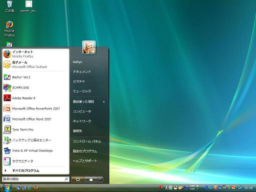

# Windows Vistaにまつわる個人的なまとめ

## Vistaの開発リリースの終了

2017年4月11日(日本時間12日)、Windows Vistaのサポートが終わりました。
Windows Vistaが店頭販売されたのは10年前の2007年1月30日のことです。
そして、Vistaの開発責任者であるジム・オールチン(Jim Allchin)は、
発売を見届けた翌日、17年在籍したマイクロソフトを退社します。

[https://japan.cnet.com/article/20342167/](https://japan.cnet.com/article/20342167/)

僕は以前、Windows VistaがプリインストールされたノートPCを使っていました。
そのあまりの酷さに、「こんなものを作ったのはいったい誰だ！」と思って調べたところ、開発責任者であるオールチンは「[自分がMS社員でなかったらMacを買う](https://japan.cnet.com/article/20338765/)」とゲイツにメールした挙句、Vistaの発売翌日に退職、現在はプロのミュージシャンになっていることを知りました。

それでオールチンに興味を持ち、いろいろ調べてみることにしました。Windows VistaとはどういうOSだったのでしょうか？ ジム・オールチンはどういう気持ちでVistaを作ったのでしょうか。このドキュメントは、僕がVista、そしてオールチンについて調べたことをまとめたものです。

## VistaというOS

Windowsは新しいものが出る度に「クソ」という烙印を押されがちです。
特にVistaは、メモリやGPU処理能力をわりと要求するOSですが、
初期のメーカーがVistaを非力なマシンに載せたため、「Vistaは重い」という印象が強くなったのだと思います。

個人的な経験で言えば、Vistaは本当に地雷でした。特にアップグレードなどもせず、
VistaプリインストールのノートPCを購入したのに、購入後最初のWindows Updateで
固って、そのまま強制電源断。

その後も、電源を切ろうとすると高確率で固まるため仕事終わりにスリープさせていたのに、
次の日出社するとファンがブン回っていたことがありました。どうも、スリープ中に
Windows Updateが来て、一定時間反応がなかったために再起動がかかり、
その際のシャットダウンに失敗して何かのプロセスが暴走、発熱し、一晩中ファンが
回り続けていたようです。下手すれば火事になりかねないところでした。

その他、UIまわりやグラフィックまわり、その他の細かいところにバグがありました。一例を挙げるなら、以下はスタートメニューの影の消し忘れバグです。

最終的に僕はこのマシンをXPにダウングレードすることにし、その後は快適に使えるようになりました。また、MS-DOS、Windows 95、2000、XP、Vistaと、これまでマイクロソフトのOSしか使っていませんでいたが、VistaをきっかけにメインマシンがMac OSXになりました。

まぁでも、ここではその辺はさておくことにします。新しく出たWindowsにバグが多いのは
これまでもよくあったことですから。また、UIを変える度にユーザから反発が出るのも
よくあることです。比較的まとまった良いOSとされるXPも、
出た当初はUIの変更に戸惑うユーザが多かったと記憶しています。

ですが、ここでは、そういう話題ともう少し異なる観点から、Windows Vistaに何があったのかを
振り返ってみたいと思います。

## CairoとLonghorn

Windows Vista、コードネームLonghornが出荷されたのは2006年ですが、
その源流は1994年に遡ります。

1994年のCOMDEXにて、ビル・ゲイツは「指先で情報を(Information At Your Fingertips)」と題した基調講演を行いました。その時の講演原稿は、例えば以下で参照できます。

[http://www.mr-gadget.de/microsoft/2008-05-21/transcript-of-bill-gates-keynote-speech-fallcomdex-nov-14-1994-information-at-your-fingertips-2005](http://www.mr-gadget.de/microsoft/2008-05-21/transcript-of-bill-gates-keynote-speech-fallcomdex-nov-14-1994-information-at-your-fingertips-2005)

1994年といえば、まだWindows 95が出る前、インターネットもそれほど普及していなかった時代です。
ここでゲイツは、コンピュータの計算能力の増大、及びネットワークの発達が、様々な環境を激変させるだろうと予測しました。特に力を入れいたのは、コンピュータネットワークでした。ネットワークがPCをつなぐことで、様々なことが可能になると言っています。

「指先で情報を」というスローガン、その中核を担うはずだったのが「Cairo」というプロジェクトです。
Cairoはネットワークを意識した先進的なOSとなるはずでした。また、オブジェクトファイルシステムを
採用することで、膨大なデータを、より柔軟に扱うことができるはずでした。

このCairoプロジェクトのリーダーこそ、ジム・オールチン、後にWindows Vistaを指揮する人物です。
Cairoは1991年から1996年くらいまで続けられましたが、リリースされることなく中止されました。

当時、マイクロソフトは社運をかけたプロジェクトをもう一つ抱えていました。Windows NTです。
Windows 3.1、そして95と成功し、大きなマーケットを得るマイクロソフトでしたが、
95の設計が古いことは早くから認識しており、メモリ保護やプリエンプションを備えた
次世代OSの開発を急いでいました。そこで、DECからデービッド・カトラーを引き抜き、
1988年から1993年にかけて完成させたWindows NTは、その後Windows 95系列を置き換えることになります。
「鬼軍曹」カトラーのもとで、全く新しいOSを作るための「デスマーチ」の様子は「闘うプログラマー」に詳細に記述されているので、興味がある人は読んでみると良いでしょう。ただし、僕は読んでて吐きそうになりましたが。

オールチンも、この「闘うプログラマー」に登場します。NTと同時期に走っていたCairoと
優秀なプログラマを取り合うなど、かなり生々しいやりとりが書いてありますが、先述のように
Cairoは失敗します。

## Cairoのキャンセル

デービット・カトラーによりWindows NTを完成させたマイクロソフトでしたが、これはあくまでサーバ用OSという位置づけでした。Windows 3.1の後継となり、Appleに対抗できるコンシューマ用OSがぜひとも必要です。しかし、その後継となるべきCairoは遅々として進まなかったため、途中からChicagoというプロジェクトが立ち上がります。

[http://www.huffingtonpost.jp/satoshi-nakajima/bill-gates-microsoft_b_10351956.html](http://www.huffingtonpost.jp/satoshi-nakajima/bill-gates-microsoft_b_10351956.html)

> もともとカイロが、前作のWindows 3.1に続く次世代ＯＳを開発する予定だったのですが、カイロは進捗が悪く、そのあいだを埋めるためにシカゴというグループが結成されました。シカゴはハッカーを寄せ集めた職人集団というイメージで、スタンフォード大学の博士号を取ったような人たちばかりのカイロとはまったく毛色が違いました。

1995年1月、Windows 3.1の後継となるOSの座を巡って、ジム・オールチン率いるCairoと、
デイビッド・コール率いるChicagoがぶつかります。マイクロソフトはCairoとChicagoのどちらを取るか。ビル・ゲイツを裁判長とする「裁判」が行われました。

Cairoチームは、400ページにわたる資料を作り、いかにChicagoがダメかを論じましたが、
Chicagoチームの責任者、中島聡氏は、Windows 95のベータ版が入ったCD-ROMを見せ、

>「カイロチームの主張にも一理あるけれど、完璧なアーキテクチャ（基本設計）を追い求めていては、永遠にものは出せません。Windows95のリリースはあと6か月に迫っています。いつになったらリリースできるかわからないカイロにマイクロソフトの将来を任せるというのは、どう考えても間違っています」

とだけ言います。数分後、ビル・ゲイツが下した判断は「カイロプロジェクトはキャンセルする」でした。

オールチンはジョージア工科大学で博士号を取得しています。カイロプロジェクトも「スタンフォード大学の博士号を取ったような人たちばかり」で構成されていました。Joel on Softwareにも[二つの話](http://japanese.joelonsoftware.com/Articles/TwoStories.html) という似たような話があります。どうもマイクロソフトではPhD持ちが悪者になる傾向にあるようです。

## Longhorn

時は流れて2001年、マイクロソフトはXPの次のOSの開発に取り掛かります。後にVistaとなる
このOSは、当時はLonghornというコードネームで呼ばれていました。掲げられたのは「ネットワークとシームレスな結合」そして「セキュリティ」でした。マイクロソフトはWindows Hardware Engineering Conference 2003（WinHEC）等で、以下のような新機能を予告、紹介していました。

* Palladium (セキュリティシステム)
* WinFS (アプリケーションがデータ形式を意識せずに情報をやりとりできるファイルシステム)
* PC-to-PC Sync (複数のPCでデータを共有するシステム)
* Microsft Max (写真共有システム)

上記の新機能のうち、特筆すべきはWinFSです。これはCairoプロジェクトで開発されていた
Object File System (OFS)の直接の子孫だからです。Cairoは「OSをオブジェクト化して扱う」という目標があり、OFSはその思想に基いて設計されています。

Palladiumは、「PCの中に金庫を作る」ものです。ハードウェアの支援を受け、PCの中に
完全に保護された仮想的なPCを作り出します。その「金庫」には、身元が保証された
ソフトウェアしかアクセスできません。これにより、例えば自宅から会社のサーバに
アクセスする際、PCの「金庫」の中からアクセスすることで、たとえ自宅PCがウィルスに
やられていても、会社に悪影響が及びません。逆に、自宅から会社にアクセスしていても、会社のサーバが
「金庫」の外、すなわち自宅のPCを覗き見していないことが保証されます。

PC to PC Syncは、ピアツーピア型のネットワーク共有システムだったようです。デモでは、複数のPCで同じデータを共有したりしていました。

Microsft Maxについては詳細を知りません。今で言うInstagramのようなものを想定していたのでしょうか？

いずれにせよ、オールチンはCairoで実現できなかった「指先で情報を」を、Vistaで実現しようとしていたのだろうと思われます。Windows 95の開発に関わった中島氏のブログにも同様な記述があります。

Longhorn は Cairo か？
[http://satoshi.blogs.com/life/2005/01/longhorn_cairo_.html](http://satoshi.blogs.com/life/2005/01/longhorn_cairo_.html)

> この Cairo プロジェクトの目玉が、やはり、「新しいユーザーインターフェイス」と「新しいファイルシステム」だったのは何とも皮肉である。結局「新しいファイルシステム」の方は日の目を見ず、「新しいユーザーインターフェイス」だけがWindows ９５という形になって出たのが１９９５年のことである。それからさらに１０年以上経って、全く同じことを繰り返しているマイクロソフトっていったい何なんだ、と思う。

## Longhorn Reset

さて、華々しく紹介されたLonghornの新機能たちはその後どうなったでしょうか？実はほとんどキャンセルされてしまいました。新機能予告で興奮し、その機能の紹介をブログなどで紹介したライターが、その機能をほとんど
キャンセルされた時の怒りをぶつけた記事が残っています。

現時点で判明した「Windows Vistaの欠点」を暴く
[http://itpro.nikkeibp.co.jp/article/COLUMN/20060510/237373/](http://itpro.nikkeibp.co.jp/article/COLUMN/20060510/237373/)

Palladiumはともかく、深刻だったのはWinFSのキャンセルです。WinFSを使えば、
対応するアプリケーションがデータを自由に扱えるようになるはずでした。
Wikipediaには、例えば「過去一年間会議を行った相手の住所」と指定することで、Outlookの情報から年賀状ソフトへ一括してデータを取り込む、という例が載っています。

[https://ja.wikipedia.org/wiki/WinFS](https://ja.wikipedia.org/wiki/WinFS)

逆に言えば、Windowsに搭載される多くのアプリケーションが、WinFSを前提とした作りになっていたはずです。
WinFSが中止になった時、多くのアプリケーションに重大な変更があったのだろうと思われます。

それを伺わせるのが、IME 2007の仕様です。IME 2007で日本語の変換をすると、
最初の候補はすぐに出るのですが、二度目の候補が出るのにえらく時間がかかる、という問題がありました。
これはIMEがOutlookの連絡先などの辞書を参考にしているためです。
僕の環境ではOutlookの連絡先辞書がなかったため、タイムアウトするまで変換候補が出ない→
変換に毎回数秒待たされる、という素敵な状態になっていました(IME2003にすることで解決)。

真相はわかりませんが、こんなことが起きたのでは、と想像します。

* IMEやOutlookはWinFSで情報を共有するようになっていた
* IMEで変換する時、Outlookの連絡先に入っている名前をWinFS経由で取得して出せるようにしていた。
* WinFSがキャンセルされたが、Outlookの連絡先に入っている名前を変換候補に出す機能は残せと言われた
* 仕方なく、IMEが直接Outlookのデータベースを辞書として使えるようにしたが、突貫工事で
　作ったのでファイルが無い時の処理が甘く、「タイムアウト」で処理するようになった

何しろ日本語入力といえばPCを使う時の基本作業です。その漢字変換に秒単位で待たされたら
作業効率もへったくれもありません。逆に言えば、そのようなことすらリリース前に気を配れないほど、Vistaプロジェクトは追い込まれていたということです。

このように大きく広げた風呂敷をたたむのに、オールチンは相当苦労したようです。

2004年、マイクロソフトは肥大化したシステムを一度破棄し、プロジェクトのやり直しを決断します(Longhorn Reset)。

[http://itpro.nikkeibp.co.jp/article/COLUMN/20070130/259976/?P=2
https://en.wikipedia.org/wiki/Development_of_Windows_Vista#Mid-2004_to_Mid-2005:_Development_.22reset.22](http://itpro.nikkeibp.co.jp/article/COLUMN/20070130/259976/?P=2
https://en.wikipedia.org/wiki/Development_of_Windows_Vista#Mid-2004_to_Mid-2005:_Development_.22reset.22)

その後も、UIのバグや不具合の修正にオールチンは奔走します。

[https://japan.cnet.com/article/20342167/](https://japan.cnet.com/article/20342167/)

> 　ワシントン州レドモンド発--マジックミラーの向こう側で、白髪の男性が「Windows Vista」内の音楽共有ライブラリにアクセスしようと奮闘している。
> 「わからない」と男性は言う。「まずいことになった」

この「まずいことになった」とつぶやいている、マジックミラーの向こう側の男性がジム・オールチンです。その後もUIにいろいろ文句を言っています。

> Allchin氏はユーザビリティラボで多くの日を過ごし、冒頭で触れた2006年2月1日もその中の1日だった。あの日の時点では、どんな操作をしても消えないダイアログボックスなど、ミュージック・ジュークボックスの挙動の細かい点に、Allchin氏は不満を募らせていた。

その後、オールチンは「不満はほとんど解消された」として、Windows Vistaをリリースします。「不満がほとんど解消された」状態がこれだとしたら、当時どういう状況であったか、想像するだに恐ろしいです。

その後、オールチンがVistaの発売日翌日にマイクロソフトを退社し、今では[プロのミュージシャンになっている](http://www.jimallchin.com/)のは冒頭に述べた通りです。

## Vistaは失敗だったのか？

結局、Vistaは失敗したのでしょうか？

これまで「次世代OS」と呼ばれるシステムは数多く計画されましたが、リリースされることなく消えていきました。
例えばAppleは、次世代OSとしてCoplandというプロジェクトを立ち上げましたが、失敗しました。

そういう意味においてVistaはリリースまでたどり着き、その一部の機能(UACやWinFXなど)は後継のシステムに受け継がれていきました。そういう意味において一概に一概に失敗とはいえないと思います。

しかし、Vistaが、当初ゲイツやオールチンが夢見た「指先で情報を」を体現するものかどうかは疑問が残ります。少なくとも[オールチンの公式サイトの経歴](http://www.jimallchin.com/biography)には「私のマイクロソフトでの最大の貢献はサーバービジネスだ」とあり、5年半をかけた(Cairoから数えると)Vistaの文字はありません。また、スティーブ・バルマーは、マイクロソフト退任にあたって[最大の後悔はVista](http://www.theverge.com/2013/8/23/4651678/ballmers-biggest-regret-windows-vista)と言っています。そういう意味で、限りなく失敗に近かったのかな？と思います。

## 終わりに

僕は個人的に、「失敗に終わった大きなプロジェクト」に興味があります。日本で言えばシグマプロジェクト、海外ならIBMのFuture Systems Projectとかがその筆頭です。マイクロソフトもCairoという大きな失敗プロジェクトがありました。そしてVistaは危うくCairoの二の舞いになりそうになりながら、土壇場で踏みとどまった、という印象です。

マイクロソフトの巨大プロジェクトとして、僕はどうしてもNTの開発を指揮したカトラーと、Cairo/Vistaを指揮したオールチンを比較してしまいます。「鬼軍曹」カトラーは強力なリーダーシップでデスマーチを完走し、NTを完成させました。特にカトラーは強烈なビジョンを持っていたような気がします。「闘うプログラマー」を見る限り、彼には完成形がかなりはっきりと見えているように見えました。そのため、次々と降ってくる仕様追加、仕様変更要求に対して、その多くを突っぱね、どうしてもマイクロソフトの将来のために必要な修正だけ取り込む、という選別ができたのでは、と想像します。

オールチンは、中島氏やJoelが嫌う「有名大学でPhDをとった人々」を引き連れ、高い理想を掲げて開発に邁進しましたが、外から見る限りではその「ビジョン」はふわっとしていて、「どういう完成形になるのか」という明確な完成形を持っていなかった印象があります。なんとかリリースにはこぎつけたものの、Vistaは「Cairoから掲げてきた理想の体現」からは程遠かったのかな、という気がします。

本稿は、あくまで一人のユーザが、ウェブで検索して調べられた範囲で、憶測で書いたものなので、誤解、誤りなど多々あることでしょう。致命的なものがあれば、ご指摘ただければ幸いです。
