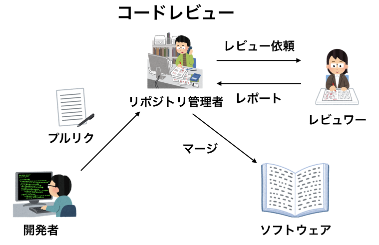

# 論文の査読をコードレビューで説明するとわかりやすい説

## はじめに

「論文の査読ってなんで必要なの？研究成果はプレプリントサーバかウェブに上げて、誰でも見られるようにするだけでいいじゃん」というような声が聞こえました。匿名の査読者が数名つくだけで、何か質的な違いが出現するのか？逆に知見の拡散の足かせになっているだけなのでは？といった気持ちなのではと想像します。

こういった疑問について、私は明確な答えを持っていません。しかし、科学技術論文における査読は、なじみのない方にとっては誤解されやすい気がします。特に「科学的な誤りや剽窃をチェックするのが査読の役割(の一つ)だ」と思っている方は多いようで、捏造論文が報じられるたびに「また査読をすり抜けた！」と思われるようです。

そこで、本稿では主にエンジニアに向けて、論文の査読をコードレビューにたとえて説明してみようと思います。

論文の査読に求められる役割は、分野によって大きくことなります。特に、論文誌の査読と、国際会議の査読はかなり性格が異なります。ここでは、主に物理系の論文誌への投稿の話を想定します。また、比喩表現の常として、どうしても誤解を招く箇所がでてきます。以下、「研究者」という大きな主語を使った場合でも、あくまで私個人の意見であることをご承知おきください。

## 査読の仕組み

研究者は論文を書いたら、論文誌に投稿します。投稿された論文は、まず論文誌の「エディター」と呼ばれる役割の人の手にわたります。エディターはその論文を読んで、却下する(Editor Reject)かどうか判断します。却下しないと判断すると、次は査読者(レビュワー)を決め、査読依頼をします。査読者は論文を読んで、査読レポートを書きます。エディターはその査読レポートを読んで、最終的に出版(アクセプト)するかどうかを決定します。多くの場合、一回でアクセプトということはなく、査読レポートに対して著者は論文を修正し、再投稿を何度か繰り返します。論文が出版できる状態になったと判断されたらアクセプトされます。

この流れは、ソフトウェアにおけるコードレビューのシステムに似ています。

プログラマは、機能追加や改修をしたものについてプルリクを作成します。作成されたプルリクは、まずリポジトリの管理者が見て、マージの必要がなければクローズ、マージの必要があればレビュワーをアサインします。レビュワーがレビューした結果、問題がある場合は開発者にフィードバックし、開発者は必要に応じて何度も変更をコミット・プッシュします。最終的に問題がなければマージされます。

対応はこんな感じになります。左側がコードレビューシステム、右側が論文査読システムです。

* 開発者 = 論文の著者
* リポジトリ管理者＝エディタ
* レビュワー = 査読者
* ソフトウェア = 論文誌
* プルリク作成 = 論文投稿
* マージ = 論文のアクセプト

## 査読の役割・査読システムの気持ち

さて、科学技術論文において、査読者は何をしているのでしょうか？いくつか誤解されてそうなポイントを列挙します。

### 掲載の可否を判断するのはエディタ

よく誤解されているのですが、論文を最終的に掲載するか、却下するかを決定するのはエディタであり、査読者ではありません。査読者は、エディタが掲載/却下を判断するための材料として査読レポートを書きます。また、著者も、査読レポートへの返事はエディタに見せるものとして書きます。つまり「査読者はこう言っているが、我々はこう思う」というような意見は、全てエディタに向けて書きます。これは、レビュワーからのレポートをもとに、最終的にマージするのはリポジトリ管理者であるような運用をしている、と思うことができます(そういう運用はあまりないかもしれませんが・・・)。

### 査読者が判断するもの、しないもの

これは業界によっても人によってもかなり違うので、私が査読をする際の個人的な心構えと思って欲しいのですが、査読者の役割は「この論文はこの論文誌に掲載するのにふさわしいか」、端的に言えば「面白いか」を判定することであって、「正しいかどうか」の判断はあくまで二次的にしか求められていません。

これは、コードレビューで言えば、今回加えられた修正が本当にそのプログラムに必要であるかを判断していることに対応します。例えば何か機能追加のプルリクをした時、その追加機能に全くバグがなくても、不要な機能であればマージされません。これは、プログラムの正しさはテストでチェックし、レビュワーは「必要かどうか」を判定する運用をしている、と思うことができます。

### 論文投稿の気持ち

論文には、手法の説明と結果だけでなく、イントロと結論・考察を書きます。特に重要なのはイントロで、そこには「なぜこの論文が書かれなければならなかったのか」「なぜこの研究は重要であるか」を、その分野の研究の流れにそって説明します。過去の論文を引用し、「現在はここまでできているが、まだここが足りない、もしくはここに問題がある。だからこの論文でそこを解決する」ということを宣言します。結論・考察には、たしかにイントロで宣言したことが解決されたことを述べたあと、この分野で次に進むべき方向や残された課題(further issues)を書きます。

これは、その研究分野を大きなソフトウェアだと思えば、論文は機能追加や問題の修正パッチのように見えます。こうして、論文は他の論文と有機的につながり、一つの大きなソフトウェアを構成する、と思うことができます。そういう意味では、論文誌もソフトウェアとみなすことができます。そのソフトウェア(蓄積された知見)を使うことで様々なことができますが、当然完璧ではないので使っていて不満がでてきます。その不満を解消するために研究をして、その成果を論文(プルリク)としてまとめ、論文誌(ソフトウェア)へのアクセプト(マージ)を目指します。

研究者が論文を書く時、単に「自分のやったことは有用だから公開する」ということだけを考えるのではなく、自分の研究が、これまでの研究の歴史においてどのような位置づけにあるかを意識します。これは、研究分野、論文誌という大きなソフトウェアを、今後どのように発展させるか、そのためにはどのように機能追加、修正していけばよいかを考えていることに対応します。これは、個人的には「有用な知見」の集合以上の意味を持っていると思います。

### 不正や捏造は誰の責任？どうやって防ぐ？

コードレビューを行っているプログラムに、バグが見つかりました。当然、誰がいれたバグかはすぐにわかります。この時、「コードレビューをしているのにバグが見つかった。コードレビューには意味がない」とは考えないと思います。もちろんマージされるコードの品質を高めるのがコードレビューの役割ですが、バグを全て防ぐことのが目的ではありませんし、そもそもそういうことは不可能です。コードレビューはバグを入れにくくするものであって、全て防ぐものではありません。査読も、論文の中で明らかな誤りを含むものや、質の低い論文を弾くことで最終的に出版される論文の質を高めますが、全ての誤りを指摘するのが目的ではありません。論文の誤りは、原則として著者の責任です。論文に誤りがあった場合は、著者が責任をもって修正するか(Erattaを出す、といいます)、致命的なものであれば論文を取り下げます。

不正なプログラムはどうでしょう？巧妙に仕組まれたバックドアを含むコードがレビューをすり抜け、後で大きな問題となったとしても、レビュワーを責めるのは酷な気がします。査読者も、論文に記載された実験結果は基本的に真実だと仮定して査読をします。全ての実験、数値計算を再現するのは現実的でない以上、悪意をもって捏造された実験結果を見抜くのは(よほど幼稚な捏造をしていない限り)困難です。

繰り返しになりますが、査読者に求められる役割は「論文の重要性の判定」であって、「論文の捏造の摘発」ではありません。投稿論文に占める捏造論文の割合は極めて小さいため、捏造を疑うことはコスト的に割に合いません。それが重要な発見であればあるほど、後に捏造であることはバレやすくなるため、科学全体としては、そこで修正がかかるはずです。「十分な目の数があれば、バグは見つけられる」というリーナスの法則と同じです。しかし、リーナスの法則を信じるとしても、コードレビューが不要であることにはなりません。すぐに見つけられるような問題は、レビューの段階で潰しておくべきです。

## まとめ

コードレビューと査読システムの類似点をあげ、査読の役割をエンジニア向けに説明してみました。もちろん私も現在の査読システムに問題がないと思っているわけではありません。特に論文誌のビジネスモデルには多くの問題があります。ですが、「論文は査読なしで全てプレプリントサーバに投稿し、重要な論文は勝手に各自で判断して読めば良い」という考えはナイーブに過ぎると思います。将来、検索エンジンが非常に賢くなれば別ですが、現状を見る限り、全くレビューされていない情報が氾濫した世界から重要な情報を抽出するのは、コスト的にわりが合わないと考えます。

ソフトウェア開発においてコードレビューという、査読システムと類似したシステムが普及しているのは、偶然ではないと思います。多くの人がゆるく関わって、一つの大きな何かを作り上げていく時、このようなシステムが(少なくとも現時点では)ベストプラクティスだ、ということではないかと思います。

